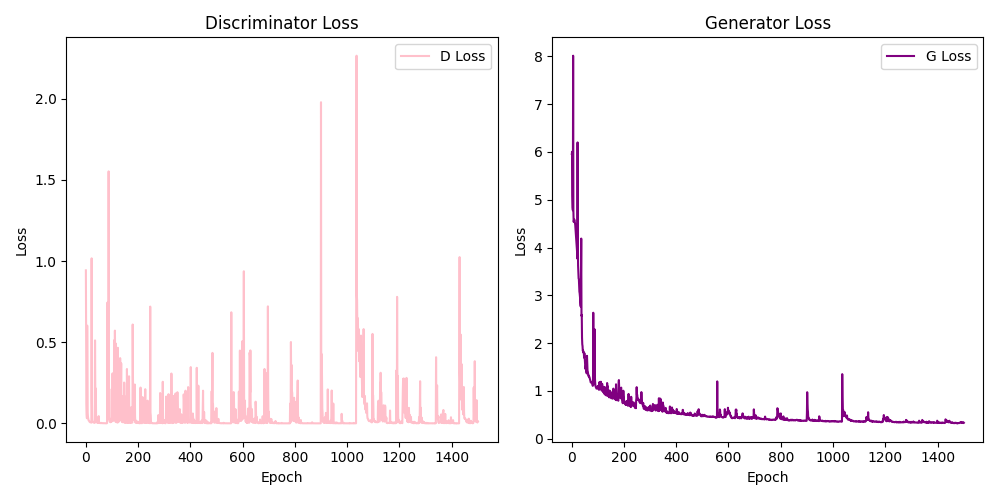

# Neural Networks and Deep Learning

本项目为天津大学 24251 学期 《神经网络与深度学习》课程设计项目，基于生成对抗网络的图像生成。

## 实验环境
本次实验全程使用 Google Colab 运行，因此无需进行环境配置，直接将项目导入 Google Drive 后，运行相应脚本即可。若要在个人电脑上运行，可以参考以下实验环境配置。

| 事项 | 配置 |
| ----- | ---- |
| 操作系统 | Windows |
| Pyhton 版本 | 3.6.13 |
| 依赖库 | os, PIL, PyTorch, Torch Vision, Matplotlib, glob, csv, json |
| 训练环境 | CUDA |

## 数据集下载
本项目中已包含原始数据集，可直接下载使用。原始数据集来源参考以下链接。

| 数据集 | 来源（链接） |
| ----- | ---- |
| BIPED | [BIPED Dataset](https://xavysp.github.io/MBIPED/) |
| SHOES | [Edge2Shoes Dataset](https://www.kaggle.com/datasets/vikramtiwari/pix2pix-dataset?resource=downloaddirectory&select=edges2shoes) |

## 运行方式

### 数据预处理
为了加快模型的训练速度，将原始数据集 `BIPED` 文件夹中的图像大小调整为 256x256，并整理成如 `BIPED_resized` 文件夹所示的存储结构。运行命令：

    python 1_resize.py

将 `BIPED_resized` 文件夹中，原始数据集的 **黑色背景白色边** 图像转换为 **白色背景黑色边** 图像，得到结果文件夹为 `BIPED_resized_BW` 。运行命令：

    python 2_background.py
*注：执行该脚本后，`BIPED_resized_BW` 文件夹不包含真实图像数据，即 `imgs_resized` 文件夹，在项目中已手动从 `BIPED_resized` 文件夹中复制。若重新运行生成新文件夹，请确保后续代码中的路径正确，或再次复制。*

将 `Shoes` 文件夹中的 **SHOES 数据集** 分割及整理成适合项目代码使用的存储结构，如 `SHOES_resized` 文件夹所示。运行命令：

    python 3_split.py

### 模型训练及预测
    python 4_main.py

运行上述命令即可进行模型的训练并得到对应参数结果。代码中使用默认最佳的数据集和参数配置。若要进行数据集或参数的调整，带代码中找到 **DATASET**、**LEARNING_RATE**、**EPOCHS** 等字眼进行修改即可。\

运行上述命令后，会生成下列几个文件或文件夹：
1. `checkpoints` 文件夹：存放属于该参数配置从 epoch=1 至 epoch=n（n 为所设置 EPOCHS 值）的信息。若训练中途中断，或想要基于该参数进行更多轮次的训练，修改 **EPOCHS** 变量后再次运行即可。程序将从 epoch=n+1 开始训练模型，减少了重复训练前 n 个轮次。\
*注：若想要训练新的模型，请确保与 `4_main.py` 脚本同一目录下的 `checkpoints` 文件夹为空，否则将会读取不同模型的 checkpoints 信息。*
2. `test_results` 文件夹：存放模型所生成的图像结果。
3. `loss_curves.png` ：Discriminator Loss 和 Generator Loss 曲线图。
4. `loss_log.csv` 及 `training_history.csv`：记录每个 epoch 的 Discriminator Loss 和 Generator Loss。

### 图像评估
对模型所生成的图像，利用 FID、IS Mean、IS Std 等评价指标进行评估，其结果在 `metrics_results.csv` 文件中展示。运行命令：
    
    python 5_score.py
*注：修改代码中的 **test_results_folder** 路径为对应的 test_results 文件夹即可。*

## 实验结果
`test_results` 文件夹中的图像结果由三部分组成，分别为：Input（输入图像，即边缘图像）、Ground Truth（真实图像） 以及 Generated（模型生成图像），如下图所示。

`loss_curves.png` 曲线图则由左右两个部分组成，左边为 Discriminator Loss曲线图，右边为 Generator Loss 曲线图。曲线图 x 轴为 epoch 的轮数，y 轴为对应的损失率，如下图所示。

## 文件说明
本项目运行的所有结果都存放于 `results` 文件夹，`ori_model` 文件夹存放初始模型运行不同数据集的结果，而 `parameter` 文件夹存放调参后的运行结果。每个文件夹都有明确且清楚的命名。\
在项目中可直接查看本次实验的所有实验结果，若要重新进行实验，可按照 **运行方式** 中所叙述的步骤执行。